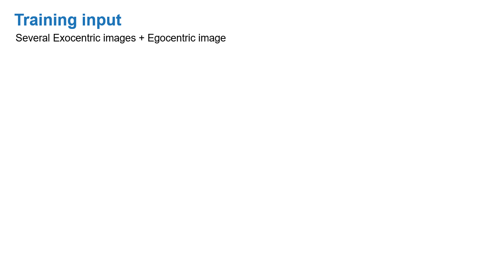

# LOCATE: Localize and Transfer Object Parts for Weakly Supervised Affordance Grounding

[](https://arxiv.org/abs/2303.09665)
[](https://reagan1311.github.io/locate/)
[](https://www.youtube.com/watch?v=RLHansdFxII) 

Official pytorch implementation of our CVPR 2023 paper - LOCATE: Localize and Transfer Object Parts for Weakly
Supervised Affordance Grounding.

## Abstract

Humans excel at acquiring knowledge through observation. For example, we can learn to use new tools by watching
demonstrations. This skill is fundamental for intelligent systems to interact with the world. A key step to acquire this
skill is to identify what part of the object affords each action, which is called affordance grounding. In this paper,
we address this problem and propose a framework called LOCATE that can identify matching object parts across images, to
transfer knowledge from images where an object is being used (exocentric images used for learning), to images where the
object is inactive (egocentric ones used to test). To this end, we first find interaction areas and extract their
feature embeddings. Then we learn to aggregate the embeddings into compact prototypes (human, object part, and
background), and select the one representing the object part. Finally, we use the selected prototype to guide affordance
grounding. We do this in a weakly supervised manner, learning only from image-level affordance and object labels.
Extensive experiments demonstrate that our approach outperforms state-of-the-art methods by a large margin on both seen
and unseen objects.

<p align="center">
 
</p>

## Usage

### 1. Requirements

Code is tested under Pytorch 1.12.1, python 3.7, and CUDA 11.6

```
pip install -r requirements.txt
```

### 2. Dataset

Download the AGD20K dataset
from [ [Google Drive](https://drive.google.com/file/d/1OEz25-u1uqKfeuyCqy7hmiOv7lIWfigk/view?usp=sharing) | [Baidu Pan](https://pan.baidu.com/s/1IRfho7xDAT0oJi5_mvP1sg) (g23n) ]
.

### 3. Train and Test

Our pretrained model can be downloaded
  from [Google Drive](https://drive.google.com/drive/folders/1-AcTiE9Lz91bPJlp1o-ubgkxKnudohdx?usp=sharing). Run following commands to start training or testing:

```
python train.py --data_root <PATH_TO_DATA>
python test.py --data_root <PATH_TO_DATA> --model_file <PATH_TO_MODEL>
```

## Citation

```
@inproceedings{li:locate:2023,
  title = {LOCATE: Localize and Transfer Object Parts for Weakly Supervised Affordance Grounding},
  author = {Li, Gen and Jampani, Varun and Sun, Deqing and Sevilla-Lara, Laura},
  booktitle={Proceedings of the IEEE/CVF Conference on Computer Vision and Pattern Recognition},
  year={2023}
}
```

## Anckowledgement

This repo is based on [Cross-View-AG](https://github.com/lhc1224/Cross-View-AG)
, [dino-vit-features](https://github.com/ShirAmir/dino-vit-features),
and [dino](https://github.com/facebookresearch/dino). Thanks for their great work!
